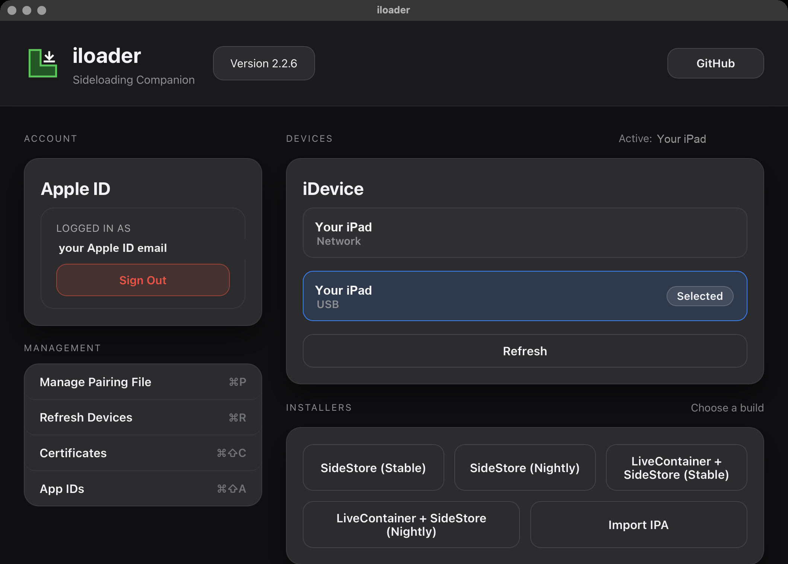
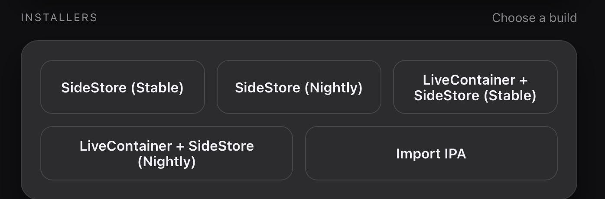
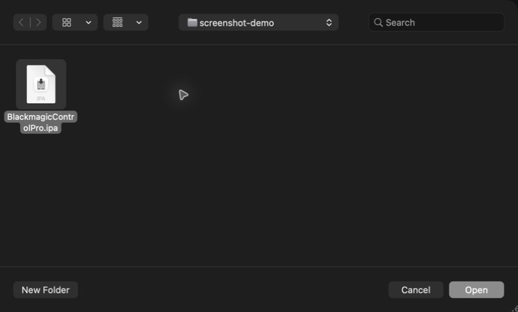

# Blackmagic Control Pro - Alpha Tester Guide

> Blackmagic Control Pro is an early test build and an unofficial hobby project. It is not made by or affiliated with Blackmagic Design.

## What you need

- **A computer** - a Mac, or a Windows PC (Windows 10 or 11, 64-bit)
- **An iPad with a USB-C port** (not the older Lightning port), with a passcode, running iPadOS 17 or newer
- **A Blackmagic camera** with Bluetooth, running **camera firmware 8.6 or newer**
- A USB cable that connects your computer to the iPad (must be a **data** cable, not charge-only)
- **A USB-C hub or dongle** - **mandatory only for the camera's built-in webcam (USB-C) method**. The iPad will not accept the camera's own webcam feed if the camera is plugged straight into its USB-C port; that feed must pass through a hub. See "How to connect the video" in Part 5
- (Only if you use the HDMI method) a **UVC (HDMI-to-USB) capture card** - this plugs **directly** into the iPad's USB-C port, no hub needed
- An Apple Account (Apple ID). A spare one is fine
- The app file from the developer - its name ends in `.ipa`
- About 15 minutes

You will use three devices in this guide. Every step below is labelled so you always know which one to pick up:

- **[COMPUTER]** - do this on your Mac or PC
- **[iPAD]** - do this on the iPad
- **[CAMERA]** - do this on the Blackmagic camera

The tool that puts the app on your iPad is called **iLoader**. You install iLoader on your computer only - nothing extra is installed on the iPad.

---

## Part 1 - Install iLoader on your computer

Follow the section for the computer you have. **Mac users skip the Windows steps, and Windows users skip the Mac steps.**

### [COMPUTER - MAC] Install iLoader on a Mac

1. Open this download link in your web browser:
   **https://github.com/nab138/iloader/releases/latest/download/iloader-darwin-universal.dmg**
2. When the download finishes, open the file (it ends in `.dmg`).
3. In the window that opens, drag the **iLoader** icon onto the **Applications** folder.
4. Open your **Applications** folder and double-click **iLoader** to start it.
5. If the Mac says the app is from an unidentified developer, open **System Settings > Privacy & Security**, scroll down, and click **Open Anyway**. Then open iLoader again.

### [COMPUTER - WINDOWS] Install iLoader on a Windows PC

Windows needs one extra program (**iTunes**) so it can talk to the iPad. Install it first.

1. Open this link and download **iTunes** for 64-bit Windows:
   **https://www.apple.com/itunes/download/win64**
2. Run the downloaded file and follow the installer to the end.
3. Now download iLoader from this link:
   **https://github.com/nab138/iloader/releases/latest/download/iloader-windows-x64.msi**
4. Run the downloaded `.msi` file and follow the installer to the end.
5. Open the **Start menu**, type `iLoader`, and open it.

> If Windows shows a blue "Windows protected your PC" box, click **More info**, then **Run anyway**.

When iLoader is open, you should see its main window.

---

## Part 2 - Put the app on your iPad with iLoader

Do all of these steps at your computer, with the iPad plugged in.

1. **[COMPUTER]** Make sure iLoader is open.
2. **[COMPUTER]** Plug the iPad into the computer using the USB cable.
3. **[iPAD]** Unlock the iPad. If it asks **"Trust This Computer?"**, tap **Trust** and type your passcode.
4. **[iPAD]** Keep the iPad unlocked and leave it plugged in for the rest of Part 2.
5. **[COMPUTER]** In iLoader, sign in with your Apple Account.
6. **[COMPUTER]** If Apple sends a two-factor code to your phone or another device, type that code into iLoader.
7. **[COMPUTER]** In iLoader, once signed in, scroll down to **Installers** and click **Import IPA**.

8. **[COMPUTER]** A file window opens. Find the app file from the developer (its name ends in `.ipa`), click it once, then click **Open**.

9. **[COMPUTER + iPAD]** Wait until iLoader says it finished. Keep the iPad unlocked and plugged in the whole time.
10. **[iPAD]** Blackmagic Control Pro is now installed. Do not open it yet - finish Part 3 first.

> Signing in uses Apple's system, and iLoader may briefly contact an Apple signing service in the background. You may see an extra computer appear in your Apple Account device list. This is normal.

---

## Part 3 - Get the iPad ready to open the app

The iPad needs two settings turned on before a test app like this will open. Do both, in order.

### [iPAD] Step A - Trust the developer

1. On the iPad, open **Settings**.
2. Tap **General**, then tap **VPN & Device Management**.
3. Under the heading **Developer App**, tap the entry that shows the Apple Account you signed in with.
4. Tap **Trust "..."**, then tap **Trust** (or "allow") again to confirm.

### [iPAD] Step B - Turn on Developer Mode

1. On the iPad, open **Settings**.
2. Tap **Privacy & Security**.
3. Scroll to the bottom and tap **Developer Mode**.
4. Turn the switch **on**.
5. The iPad asks to restart. Tap **Restart**.
6. After it restarts, unlock the iPad. A message appears asking to turn on Developer Mode - tap **Turn On** and type your passcode.

> If you do not see **Developer Mode** in the list, make sure the app installed in Part 2, then restart the iPad and look again.

---

## Part 4 - Open the app

1. **[iPAD]** Open the **Blackmagic Control Pro** app. If you do not see it on the Home Screen, swipe left to the App Library or pull down on the Home Screen and search for "Blackmagic".
2. **[iPAD]** When it asks to use **Bluetooth**, tap **Allow**. The app needs Bluetooth to control the camera.

The app is now ready. Next, connect your camera.

---

## Part 5 - Connect your Blackmagic camera

The camera connects in two ways: **Bluetooth** for the controls, and a **USB video feed** (camera webcam through a hub, or an HDMI capture card plugged straight in) for the live picture.

### [iPAD] Step A - Open the camera connection screen

1. When you open the app with no camera connected, the **Camera Connection** screen appears on its own.
2. If it is not showing (for example, you are switching to a different camera), tap the button in the **top-left corner** to open it.

### [CAMERA] Step B - Turn on Bluetooth

1. On the camera, open the **Setup** menu (swipe to the Bluetooth page).
2. Turn **Bluetooth** on.

### [iPAD] Step C - Pair and take remote control

1. On the **Camera Connection** screen, under **Nearby Cameras**, tap your camera when it appears.
2. **[CAMERA]** The camera screen shows a **6-digit PIN**.
3. **[iPAD]** Type that 6-digit PIN into the app when it asks.

Once paired, the app can remote-control the camera - exposure, white balance, and the other settings.

### [CAMERA + iPAD] Step D - How to connect the video

Feed video into the iPad using **one** of these two methods:

**Method 1 - Camera's built-in webcam over USB-C.** This method **requires a USB-C hub/dongle**: the iPad will not accept the camera's webcam feed plugged straight into its USB-C port. Most cheap USB-C dongles will work. Do this first, before plugging in:

1. **[CAMERA]** Open the camera **Setup** menu, look for **Webcam Mode**, and turn it **on**. (This needs camera firmware **8.6 or newer**.)
2. **[iPAD]** Plug your **USB-C hub** into the iPad's USB-C port.
3. **[CAMERA]** Connect a USB cable from the camera's **USB-C** port into the **hub** (not straight into the iPad).

**Method 2 - HDMI capture card.** Use this if you prefer the camera's HDMI output. **No hub is needed** - the capture card plugs directly into the iPad:

1. **[CAMERA]** Connect the camera's **HDMI** port to a **UVC capture card** with an HDMI cable.
2. **[iPAD]** Plug the capture card's **USB** directly into the iPad's USB-C port. Webcam Mode is not needed for this method.

> **Warning:** some cheap UVC capture cards misbehave. If the picture in the app **flickers**, disconnect the capture card **immediately** to protect the camera's HDMI output from damage, then try a different capture card or use the USB-C webcam method instead.

Then, either way:

- **[iPAD]** The live picture appears in the app within a few seconds. If it stays black, reseat the cables.

---

## If something goes wrong

### [COMPUTER] The iPad does not show up in iLoader

- **[iPAD]** Unlock the iPad and keep its screen on.
- **[COMPUTER]** Unplug and replug the USB cable.
- **[iPAD]** If it asks, tap **Trust** and type the passcode.
- **[COMPUTER]** Try a different USB port, or a different cable that supports data (not charge-only).

### [iPAD] The app will not open

- Redo **Part 3, Step A** (Trust the developer).
- Redo **Part 3, Step B** (Developer Mode is on).

### [iPAD + CAMERA] The camera will not connect

- **[CAMERA]** Make sure the camera is on and its Bluetooth is turned on.
- **[iPAD]** Make sure Bluetooth is on (open Control Center or Settings).
- **[CAMERA]** Keep the camera close to the iPad for the first connection - it can take more than one try.
- **[CAMERA]** If the live picture is black: with the camera's USB webcam, confirm the feed goes through a **USB-C hub** (the camera straight into the iPad will not work) and that **Webcam Mode** is on. With an HDMI capture card, plug the card **directly** into the iPad. Then reseat the cables.
- **[CAMERA]** If the live picture **flickers** with an HDMI capture card, disconnect the card **immediately** to protect the camera's HDMI output, then try a different capture card or the USB-C webcam method.

---

## Send a problem report

If something breaks or does not work as expected, send the developer a report straight from the app.

1. **[iPAD]** Open **Blackmagic Control Pro**.
2. **[iPAD]** Open **Settings**, then **About**.
3. **[iPAD]** Tap **Send Diagnostics**. An email opens already addressed and with the report attached. Add one sentence about what happened, then tap send.
4. **[iPAD]** If no email opens, tap **Share** instead and send the file to **krishnanelloore@gmail.com** using any app.

The report contains app logs only. It does not include your recordings or photos, and your device name is removed automatically.

Have an idea for the app? Feature requests are welcome at the same email: **krishnanelloore@gmail.com**.

Thank you for testing Blackmagic Control Pro.
